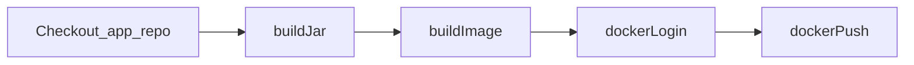

# Jenkins Shared Library

Reusable **Pipeline steps** for Jenkins CI/CD jobs in the DevOps Bootcamp (Module 8). This repository holds Groovy code you load into Jenkins once and call from many **Jenkinsfiles**, instead of copying the same build, Docker, and push logic into every project.

---

## What is a Jenkins Shared Library?

A **Shared Library** lets you **share parts of Pipelines** between projects and reduce duplication. Typical use cases from the handout:

- The **same logic** across multiple microservices (for example build JAR, build image, push to a registry).
- **Many projects** in a company that share common tasks but differ in application code.

You store the library in a **Git repository** (this repo), register it in Jenkins, then reference it from Pipeline jobs with **`@Library`** in a **Jenkinsfile**.

---

## Repository structure

Jenkins Shared Libraries follow a standard layout:

```text
jenkins-shared-library/
├── vars/                    # Global Pipeline steps (callable by file name)
│   ├── buildJar.groovy
│   ├── buildImage.groovy
│   ├── dockerLogin.groovy
│   └── dockerPush.groovy
└── src/
    └── com/example/
        └── Docker.groovy    # Reusable Groovy class used by vars/
```

| Path | Role |
|------|------|
| **`vars/*.groovy`** | Each file defines a **global variable** / step. The **file name** (without `.groovy`) is the function you call in a Pipeline—for example `buildJar()`, `dockerPush('my-app:1.0')`. |
| **`src/`** | **Classes** in packages (here `com.example.Docker`) that hold shared implementation. Vars can delegate to these classes for cleaner, testable code. |

There is no `resources/` folder in this library; add one later if you need non-Groovy files (templates, scripts) bundled with the library.

---

## Included steps

### `buildJar()`

Runs **`mvn package`** to compile and package the Java Maven application. Logs the current branch using the **`GIT_BRANCH`** environment variable Jenkins sets during SCM checkout.

Defined in [vars/buildJar.groovy](./vars/buildJar.groovy).

**Requires:** Maven available on the Jenkins agent (plugin **Maven Integration** / `tools { maven '...' }` in the Jenkinsfile, or Maven installed on the agent). The job should **`dir()`** into the Maven project before calling this step.

### `buildImage(imageName)`

Builds a Docker image from the **current directory** (Docker build context):

```bash
docker build -t <imageName> .
```

Defined in [vars/buildImage.groovy](./vars/buildImage.groovy); implementation in [src/com/example/Docker.groovy](./src/com/example/Docker.groovy).

**Requires:** Docker on the Jenkins agent. Run from the directory that contains the **Dockerfile**.

### `dockerLogin()`

Logs in to a Docker registry using Jenkins **credentials** with id **`docker-hub-repo`** (username/password). Uses `docker login` with `--password-stdin`.

Defined in [vars/dockerLogin.groovy](./vars/dockerLogin.groovy).

**Requires:** A **Username with password** credential in Jenkins (scope **Global**), id exactly **`docker-hub-repo`**, with access to the registry you push to.

### `dockerPush(imageName)`

Pushes a tagged image:

```bash
docker push <imageName>
```

Defined in [vars/dockerPush.groovy](./vars/dockerPush.groovy).

**Requires:** Successful **`dockerLogin()`** (or an existing login) and an image already built and tagged as **`imageName`**.

---

## Configure the library in Jenkins

Per the handout workflow: **create the library → make it available in Jenkins → use it in Pipelines**.

### 1. Host the library in Git

This project is intended to live in its own Git repo (for example `jenkins-shared-library` on GitHub). Push this folder’s contents to the remote Jenkins can read.

### 2. Register in Jenkins (global)

1. **Manage Jenkins** → **System** (or **Configure System**).
2. Find **Global Pipeline Libraries**.
3. Add a library, for example:
   - **Name:** `jenkins-shared-library` (this is the name you use in `@Library('jenkins-shared-library')`).
   - **Default version:** `main` (or your default branch).
   - **Retrieval method:** Modern SCM → Git → repository URL and credentials Jenkins uses to clone.

Save. Jenkins will fetch the library when a Pipeline that references it runs.

You can also scope a library to a **folder** instead of globally; global registration matches the course “configure globally” step.

### 3. Jenkins credentials

Create **Global** credentials for Docker registry login:

| Field | Value |
|-------|--------|
| Kind | Username with password |
| ID | `docker-hub-repo` |
| Username / Password | Your registry account |

The id **`docker-hub-repo`** must match [Docker.groovy](./src/com/example/Docker.groovy).

---

## Use the library in a Jenkinsfile

At the top of a **Declarative** or **Scripted** Pipeline Jenkinsfile, load the library and call the steps inside **`script { }`** (or in a Scripted Pipeline body).

**Example** (adjust image name and stages to your app):

```groovy
@Library('jenkins-shared-library') _

pipeline {
    agent any
    tools {
        maven 'maven-3.9'
    }
    stages {
        stage('Build JAR') {
            steps {
                dir('java-maven-app') {
                    script {
                        buildJar()
                    }
                }
            }
        }
        stage('Build and push image') {
            steps {
                dir('java-maven-app') {
                    script {
                        def image = 'YOUR_REGISTRY/YOUR_IMAGE:YOUR_TAG'
                        buildImage(image)
                        dockerLogin()
                        dockerPush(image)
                    }
                }
            }
        }
    }
}
```

Notes:

- **`@Library('jenkins-shared-library') _`** — library **name** must match Jenkins configuration; `_` loads the default version.
- Call **`buildJar()`**, **`buildImage(...)`**, etc. **without** a prefix—they are global steps from `vars/`.
- Use **`dir('...')`** so Maven and `docker build` run in the project that contains `pom.xml` and the Dockerfile.

### Alternative: local `script.groovy` in the application repo

The course demo [java-maven-app/script.groovy](../devops-08-automation-ci-cd-with-jenkins/java-maven-app/script.groovy) loads **project-local** Groovy with `load './java-maven-app/script.groovy'`. That pattern is fine for one repo. This **shared library** moves the same ideas (**build JAR**, **build/push image**) into a **separate Git repo** so **many** Jenkinsfiles can call **`buildJar()`** and **`dockerPush()`** without duplicating files.

---

## Typical CI/CD flow with this library



1. Jenkins checks out the **application** repository (webhook or manual trigger).
2. **`buildJar()`** produces the Maven artifact.
3. **`buildImage(tag)`** builds the container from the Dockerfile.
4. **`dockerLogin()`** authenticates to the registry using stored credentials.
5. **`dockerPush(tag)`** publishes the image for deployment environments to pull.

---

## Prerequisites on the Jenkins server

- **Jenkins** with **Pipeline** support and permission to configure **Global Pipeline Libraries**.
- **Maven** for `buildJar()` (tool installer or agent with `mvn` on `PATH`).
- **Docker** on the agent for build/login/push steps (if Jenkins runs in Docker, mount the host Docker socket or use a Docker-in-Docker setup as covered in the Jenkins module).
- **Git** access from Jenkins to this library repo and to application repos.

---

## References

- Jenkins: [Extending with Shared Libraries](https://www.jenkins.io/doc/book/pipeline/shared-libraries/)
- Related demo app and Jenkinsfile examples: [devops-08-automation-ci-cd-with-jenkins](../devops-08-automation-ci-cd-with-jenkins/)
